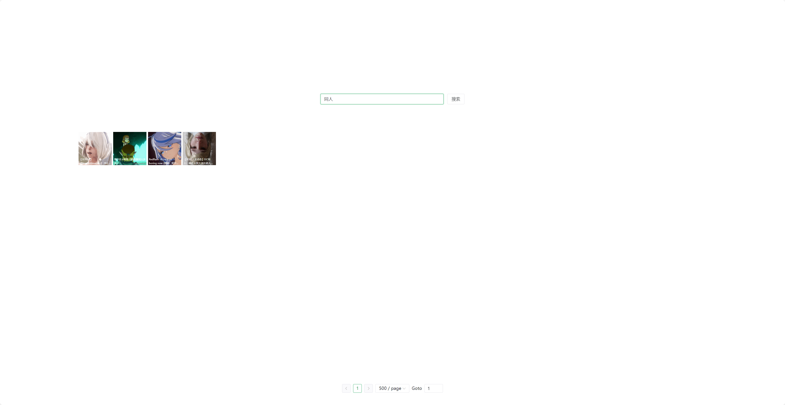

# WallpaperVideo

### 小红车播放器

Q: 它的作用是什么？ A: 在线播放你下载的壁纸

Q: 适用场景？ A: 需要用nas下载壁纸，并且想要在线预览与检索

Q: 为什么使用它? A: 使用WallpaperEngine时想要观看视频壁纸需要设置为壁纸或右键使用此电脑检索，同时在此电脑中检索时不又不方便关键词的查找与视频的快速预览。我认为此项目完美的解决了这个问题

### 如何使用

`-p --port 可以设置端口号 默认 8080`

`-f --file 可以创意工坊的位置 默认 Z:\SteamLibrary\steamapps\workshop\content\431960`

示例:

`java -jar WallpaperVideo-jar-with-dependencies.jar -p 8080 -f Z:\SteamLibrary\steamapps\workshop\content\431960`

启动时或自动释放前端文件到当前dist目录，如需要更新前端文件则手都删除dist后重新自启动即可

